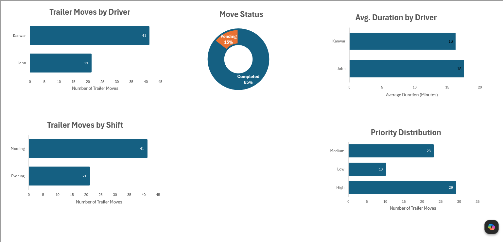

# 🚛 Trailer Movement Operations Dashboard

## 📖 Project Overview

This project demonstrates an end-to-end data analytics workflow using Microsoft Excel. The objective was to transform raw trailer movement data into meaningful business insights through data cleaning, analysis, and visualization.

The project includes data preparation, PivotTables, PivotCharts, and a professional dashboard to help monitor warehouse trailer movement operations.

---

## 🎯 Project Objectives

- Clean and organize raw operational data.
- Handle missing values and data inconsistencies.
- Analyze trailer movement performance.
- Build PivotTables to summarize operational data.
- Create a dashboard for easy visualization and decision-making.

---

## 🛠️ Tools & Skills Used

### Microsoft Excel
- Data Cleaning
- Tables
- PivotTables
- PivotCharts
- Dashboard Design

### Excel Functions
- IF
- XLOOKUP
- TRIM
- Time Calculations
- COUNTIF
- AVERAGE

---

## 📂 Dataset

The dataset contains trailer movement information, including:

- Trailer ID
- Driver
- Shift
- Priority
- Move Request Time
- Move Completed Time
- Move Status
- Duration

---

## 🧹 Data Cleaning Process

The raw dataset was cleaned by:

- Removing duplicate records
- Correcting spelling inconsistencies
- Standardizing shift names
- Handling missing values
- Formatting date and time fields
- Creating duration calculations
- Organizing the data into an Excel Table

---

## 📊 Dashboard Features

The dashboard provides insights into:

- 🚛 Trailer Moves by Driver
- 🌅 Trailer Moves by Shift
- ⏱️ Average Move Duration by Driver
- ⏱️ Average Move Duration by Shift
- 🥧 Priority Distribution
- 🍩 Move Status Distribution

---

## 📈 Business Insights

## 📈 Key Insights

• Kanwar completed the highest number of trailer moves.

• The Morning Shift handled more trailer movements than the Evening Shift.

• High-priority requests represented the largest share of trailer movements.

• 85% of trailer requests were completed successfully.

• Kanwar's average completion time was lower than John's.

---

## 🔄 Analytics Workflow

Raw Data

⬇️

Data Cleaning

⬇️

Excel Table

⬇️

PivotTables

⬇️

PivotCharts

⬇️

Dashboard

⬇️

Business Insights

---

## 💡 What I Learned

Through this project, I gained practical experience in the complete data analysis process using Microsoft Excel.

Key skills I developed include:

- Cleaning and preparing raw data
- Using Excel formulas to automate calculations
- Building PivotTables for data analysis
- Creating PivotCharts for visualization
- Designing a professional dashboard
- Presenting operational data in a meaningful way

This project strengthened my understanding of how data analysts transform raw data into actionable business insights.

---

## 📁 Project Files

- Trailer_Movement_Operations_Dashboard.xlsx
- Trailer_Movement_Operations_Dashboard.pdf
- Dashboard Screenshots

---

## 🚀 Future Improvements

- Recreate this dashboard using Power BI.
- Perform SQL analysis on the same dataset.
- Build an interactive Power BI dashboard with slicers and KPIs.
- Automate reporting using Power Query.

---

## 👨‍💻 About Me

I am an aspiring Data Analyst currently building projects in:

- Microsoft Excel
- SQL
- Power BI
- Python

My goal is to continue developing real-world analytics projects while expanding my technical and business analysis skills.

---

## 📬 Connect With Me

**LinkedIn**

https://www.linkedin.com/in/kanwardeep-singh-3014a1398/

**GitHub**

https://github.com/kanwardeepsinghbhamra

---

⭐ Thank you for taking the time to view this project. Feedback and suggestions are always welcome!
